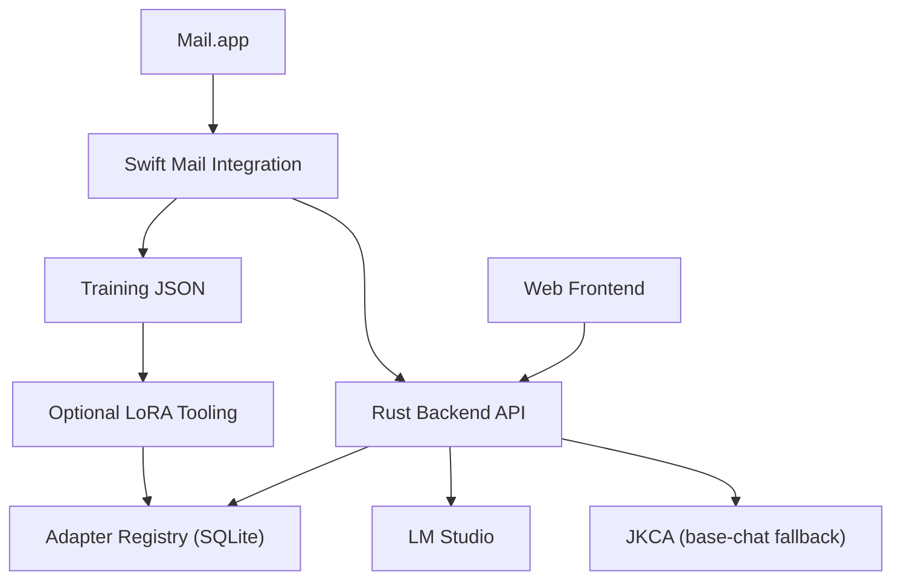

# EmailBrain System Architecture Analysis

## System Overview

EmailBrain is a local-first email assistant with four active surfaces:

1. **Swift Mail Integration App** (`swiftmail/mailbrain/`) extracts a message from Mail.app, sends it to the Rust backend, and can emit training data for adapter work.
2. **Rust Backend** (`backend/`) owns the runtime API, SQLite storage, chat routing, and adapter registry.
3. **Next.js Frontend** (`frontend/`) provides the email browser, adapter list, and chat UI against the Rust API.
4. **Optional LoRA Tooling** (`adapters/`) trains and tests adapters from extracted email data.

The adapter-capable product path is LM Studio. `jkca-agent` is retained as an optional fallback for base-model chat when no adapter is selected.

## Runtime Contract

### Backend (Rust / Axum)
- Location: `/backend/`
- Key files: `Cargo.toml`, `src/main.rs`, `db/schema.sql`
- Routes:
  - `GET /health`
  - `GET /api/v1/emails`
  - `POST /api/v1/emails`
  - `GET /api/v1/emails/{email_id}`
  - `GET /api/v1/adapters`
  - `POST /api/v1/chat`

### Inference Routing
- Default provider: `lmstudio`
- Optional fallback provider: `jkca`
- Adapter-backed requests are always routed through LM Studio until JKCA can honor EmailBrain's adapter contract.

### Frontend
- Location: `/frontend/`
- Current state:
  - Email list and detail views are wired to the Rust API.
  - Adapter selection is backed by SQLite adapter metadata.
  - Chat submits to `/api/v1/chat`.
  - Selected adapters are presented as LM Studio-backed behavior.

### Swift Mail Integration
- Location: `/swiftmail/mailbrain/`
- Current state:
  - Fetches the first inbox message from Mail.app via AppleScript.
  - Posts selected email content to `http://localhost:3901/api/v1/emails`.
  - Exports LoRA training JSON for the selected email.

### Optional LoRA Tooling
- Location: `/adapters/`
- Current state:
  - `train_lora.py` consumes extracted email JSON and registers trained adapters.
  - `test_lora.py` validates adapter-backed chat by targeting the local EmailBrain API.

## Data Flow

## Known Constraints

- Mail ingestion is still manual from the Swift UI; there is no bulk mailbox sync.
- LoRA training remains Python-only and optional.
- Adapter-backed chat depends on LM Studio being available.
- JKCA is only suitable for base-model chat until it supports adapter semantics.

## Verification Expectations

- Swift source should pass `swiftc -typecheck`.
- Backend should pass `cargo test`.
- Frontend should pass `npm run build`.
- Adapter tooling should be able to consume one real extracted email JSON fixture and hit the local EmailBrain API.
