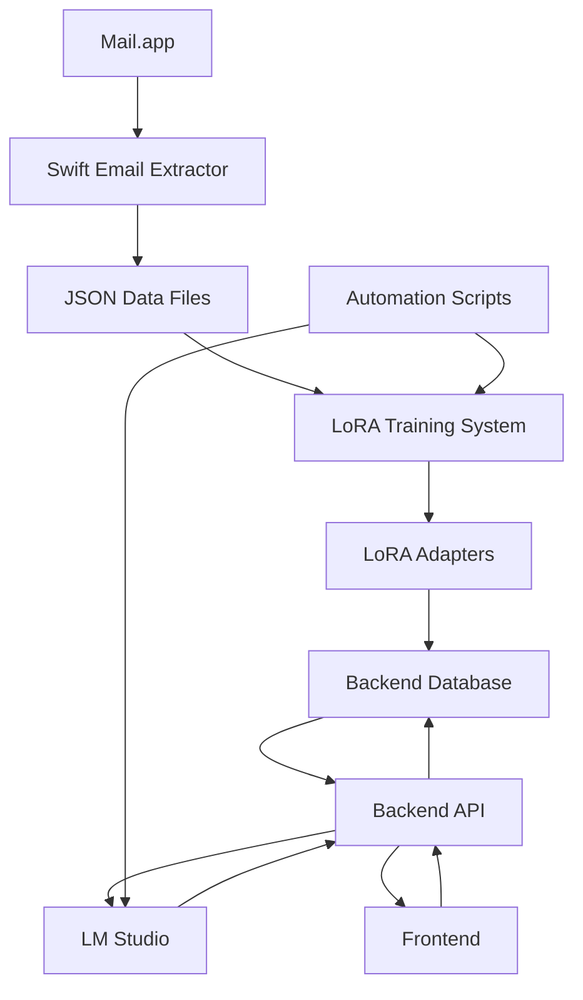

# EmailBrain System Architecture Analysis

## System Overview

EmailBrain is a local-first AI assistant designed to digest email content and surface insights through LoRA-adapted language models. The system consists of five main components:

1. **Swift Mail Integration App** (`swiftmail/mailbrain/`) - Extracts emails from Mail.app
2. **FastAPI Backend** (`backend/`) - Provides API endpoints and manages LoRA adapters
3. **Next.js Frontend** (`frontend/`) - Web interface for user interactions
4. **LoRA Training System** (`adapters/`) - Trains custom adapters from email data
5. **LM Studio Integration** - External AI model server

## Component Architecture

### 1. Backend (FastAPI)
**Location**: `/backend/`
**Key Files**: [`main.py`](backend/main.py), [`config.py`](backend/config.py), [`db/schema.sql`](backend/db/schema.sql)

**API Endpoints**:
- `POST /api/v1/chat` - Process text with optional LoRA adapter
- `GET /api/v1/adapters` - List available LoRA adapters
- `GET /health` - Health check

**Database Schema** (SQLite):
- `emails` - Email content and metadata
- `adapters` - LoRA adapter registry
- `insights` - Generated email insights
- `logs` - Chat interaction history

**Dependencies**: FastAPI, httpx, sqlite3, pydantic

### 2. Frontend (Next.js 15 / React 19)
**Location**: `/frontend/`
**Key Files**: [`package.json`](frontend/package.json), [`app/page.tsx`](frontend/app/page.tsx), [`app/layout.tsx`](frontend/app/layout.tsx)

**Current State**: Minimal placeholder implementation
- Basic Next.js setup with TypeScript
- Tailwind CSS for styling
- Single page with placeholder content
- No API integration implemented

**Missing Components**:
- Email list/viewer interface
- LoRA adapter management UI
- Training pipeline integration
- API client for backend communication

### 3. Swift Mail Integration
**Location**: `/swiftmail/mailbrain/`
**Key Files**: [`EmailExtractor.swift`](swiftmail/mailbrain/mailbrain/EmailExtractor.swift), [`MailService.swift`](swiftmail/mailbrain/mailbrain/MailService.swift), [`ContentView.swift`](swiftmail/mailbrain/mailbrain/ContentView.swift)

**Functionality**:
- Uses AppleScript to extract emails from Mail.app
- Formats email data for LoRA training
- Saves extracted data to JSON files
- SwiftUI interface for manual email extraction

**Email Processing Flow**:
1. Fetch first email from Mail.app inbox using AppleScript
2. Format data into training examples (subject completion, summarization, etc.)
3. Save to `adapters/data/email_data_TIMESTAMP.json`

### 4. LoRA Training System
**Location**: `/adapters/`
**Key Files**: [`train_lora.py`](adapters/train_lora.py), [`create_lora.sh`](adapters/create_lora.sh), [`test_lora.py`](adapters/test_lora.py)

**Training Pipeline**:
- Reads JSON data from Swift mail extraction
- Uses PEFT library for LoRA fine-tuning
- Registers trained adapters in database
- Supports testing via API integration

**Model Support**: Phi-3-Mini (GGUF format)

### 5. Automation Scripts
**Location**: `/scripts/`, `/launchd/`
**Key Files**: [`reload_lmstudio.scpt`](scripts/reload_lmstudio.scpt), [`nightly.train.plist`](launchd/nightly.train.plist)

**Automation**:
- Nightly training scheduled via launchd
- LM Studio restart capability
- Monorepo structure with pnpm workspace

## Data Flow Architecture

## Critical Integration Gaps

### 1. Frontend-Backend Integration
**Status**: NOT IMPLEMENTED
**Issues**:
- Frontend has no API client or service layer
- No components for adapter management
- No email viewing interface
- Missing state management for chat interactions

### 2. Swift App - Backend Communication
**Status**: PARTIALLY IMPLEMENTED
**Issues**:
- [`MailService.sendEmailToBackend()`](swiftmail/mailbrain/mailbrain/MailService.swift:89) only prints to console
- No HTTP client implementation in Swift app
- Emails not automatically stored in backend database

### 3. Email Data Ingestion Pipeline
**Status**: MANUAL ONLY
**Issues**:
- No automated email ingestion from Mail.app
- Manual extraction required via Swift app UI
- No bulk email processing capability

### 4. Training Pipeline Integration
**Status**: FUNCTIONAL BUT ISOLATED
**Issues**:
- LoRA training works but requires manual trigger
- No frontend visibility into training status
- No validation of adapter quality

### 5. Model Configuration Management
**Status**: BASIC
**Issues**:
- Hard-coded LM Studio endpoint (127.0.0.1:1234)
- No model switching capability
- Limited error handling for model unavailability

## Component Relationship Matrix

| Component | Frontend | Backend | Swift App | LoRA System | LM Studio |
|-----------|----------|---------|-----------|-------------|-----------|
| Frontend  | -        | Missing | None      | None        | None      |
| Backend   | Missing  | -       | Missing   | Database    | HTTP      |
| Swift App | None     | Missing | -         | File        | None      |
| LoRA      | None     | Database| File      | -           | None      |
| LM Studio | None     | HTTP    | None      | None        | -         |

## Technical Debt & Architecture Issues

### 1. Configuration Management
- Empty `.env.example` file
- Hard-coded URLs and ports throughout codebase
- No environment-specific configuration

### 2. Error Handling & Logging
- Inconsistent error handling patterns
- Limited logging in Swift components
- No centralized error reporting

### 3. Data Consistency
- Multiple data storage patterns (SQLite, JSON files)
- No data validation between components
- Potential race conditions in file-based operations

### 4. Security Considerations
- No authentication/authorization
- Direct database access patterns
- Unvalidated AppleScript execution

## Recommended Integration Strategy

### Phase 1: Core Integration
1. Implement HTTP client in Swift app for backend communication
2. Create frontend API service layer with proper error handling
3. Build email list and viewer components in frontend
4. Connect frontend to backend chat API

### Phase 2: Data Pipeline
1. Implement automated email ingestion from Swift app to backend
2. Add bulk email processing capabilities
3. Create training pipeline status monitoring
4. Implement adapter quality validation

### Phase 3: User Experience
1. Build adapter management interface
2. Add training progress visualization
3. Implement email insight generation
4. Create comprehensive error handling and user feedback

### Phase 4: Production Readiness
1. Add authentication and security measures
2. Implement comprehensive logging and monitoring
3. Add configuration management system
4. Create deployment and backup strategies

## Dependencies & Requirements

### Runtime Dependencies
- **Backend**: Python 3.8+, FastAPI, SQLite
- **Frontend**: Node.js 20+, Next.js 15, React 19
- **Swift**: macOS, Xcode, Mail.app permissions
- **LoRA**: PyTorch, Transformers, PEFT, Datasets
- **External**: LM Studio server

### Development Dependencies
- **Frontend**: TypeScript, Tailwind CSS, ESLint
- **Backend**: Uvicorn, Pydantic, httpx
- **Testing**: Vitest, Playwright, Python unittest

This analysis provides a comprehensive foundation for implementing the integration work needed to create a fully functional EmailBrain system.