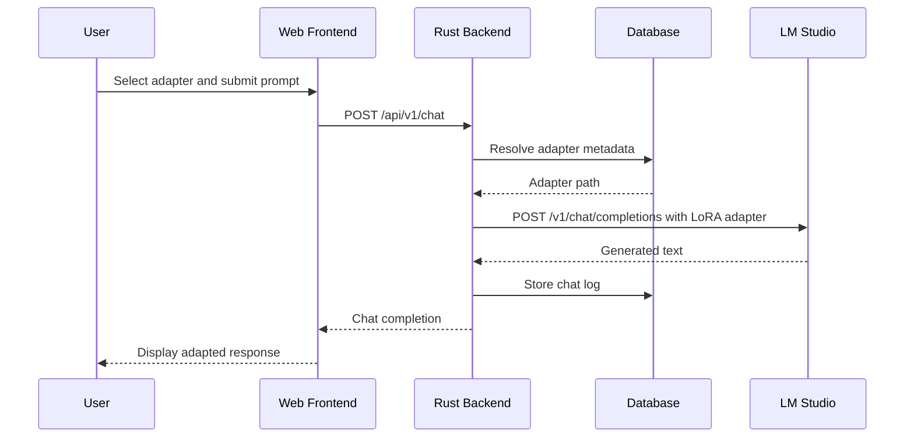
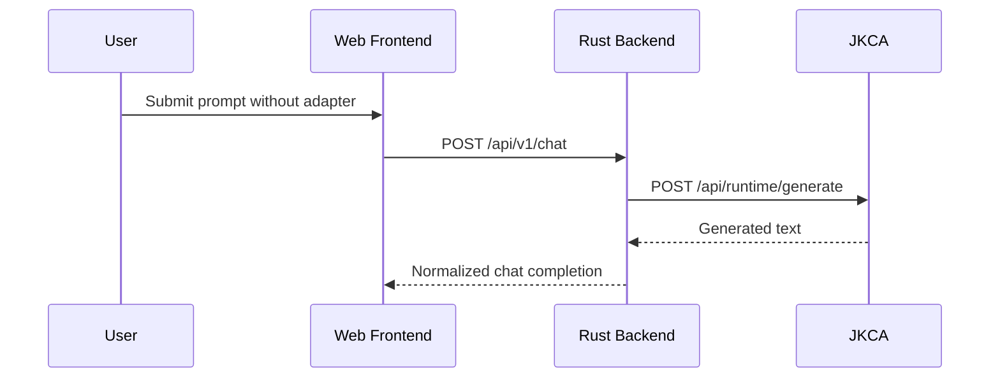

# System Architecture Sequence Diagram

This document describes the current request flow through EmailBrain's primary chat path and the optional JKCA fallback path.

## Adapter-Capable Chat Path

## Base-Chat Fallback Path

## Notes

- Adapter-backed requests are routed through LM Studio.
- JKCA is only used for base-model chat when configured as the fallback provider.
- All chat traffic is normalized by the Rust backend before the frontend consumes it.
