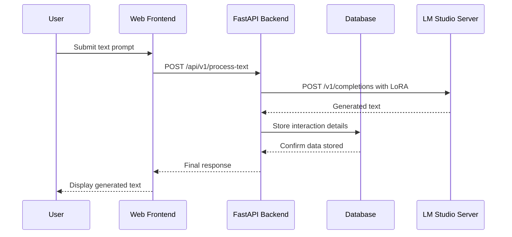

# System Architecture Sequence Diagram

This document contains the Mermaid.js sequence diagram that illustrates the interaction flow between the five main components of the system: User, Web Frontend, FastAPI Backend, Database, and LM Studio Server.

## Sequence Diagram

## Flow Description

1. **User submits text prompt** - User initiates the process by submitting a text prompt through the web interface
2. **Frontend to Backend** - Web Frontend sends a POST request to `/api/v1/process-text` endpoint on the FastAPI Backend
3. **Backend to LM Studio** - FastAPI Backend forwards the request to LM Studio Server via POST `/v1/completions` with LoRA configuration
4. **LM Studio Response** - LM Studio Server processes the request and returns generated text (shown as dotted line for response)
5. **Store to Database** - FastAPI Backend stores the interaction details in the Database
6. **Database Confirmation** - Database confirms successful storage (shown as dotted line for response)
7. **Backend Response** - FastAPI Backend sends the final response back to Web Frontend (shown as dotted line for response)
8. **Display to User** - Web Frontend displays the generated text to the User (shown as dotted line for response)

## Notes

- Solid arrows represent requests/commands
- Dotted arrows represent responses/returns
- The diagram shows the complete request-response cycle for text processing through the system